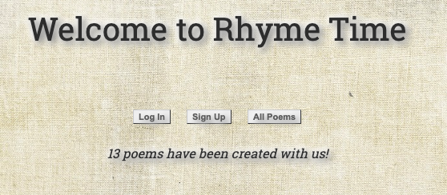
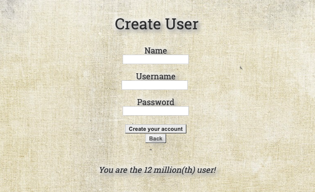
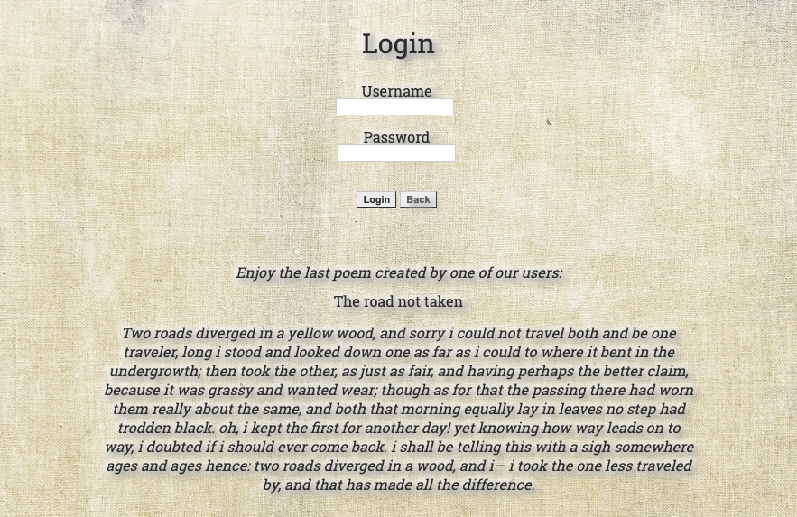
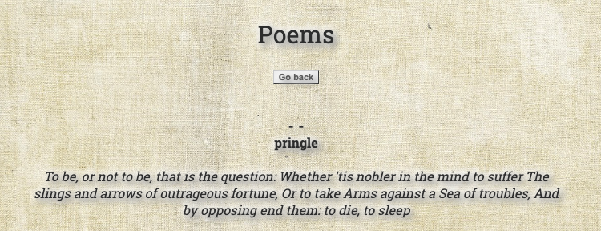
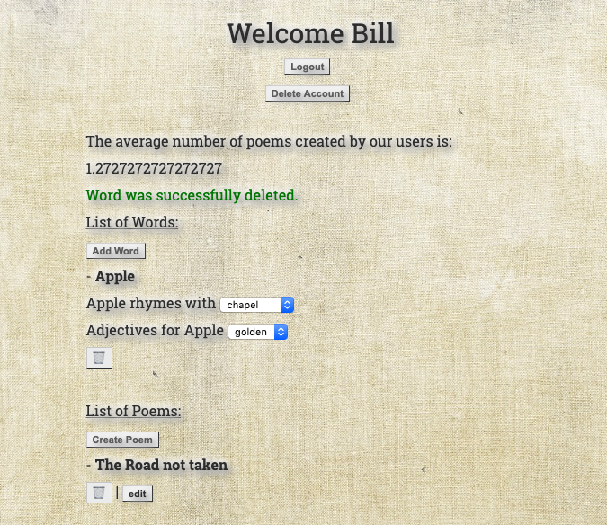
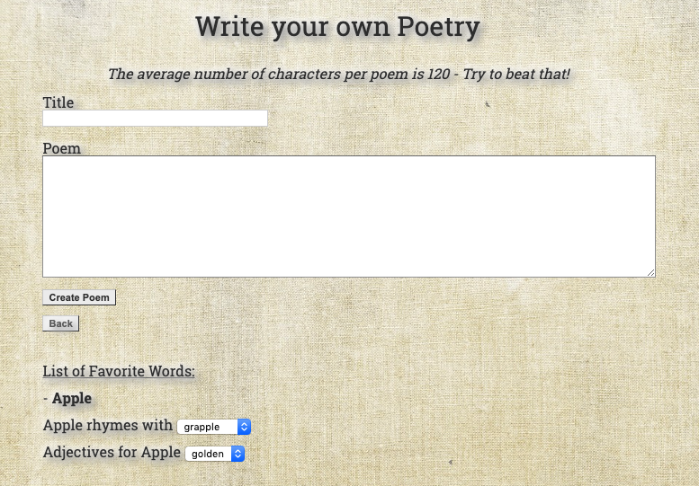

# Rhyme Time

## App to help users write rhyming poetry

Project by [@codeHustler91](https://github.com/foggybrains) and [@rjortega](https://github.com/rjortega)

Thanks for checking it out!

[Heroku deployment](https://mysterious-tor-87367.herokuapp.com/users)

## Basic flow of app

### Welcome Menu
   * Login, Sign Up, and view all poems
   * Get inspired by a random Shakespeare Sonnet!
   * Visit the app github page and Flatiron School website through the links in the top right corner

   

### Create User/Sign Up
   * Enter your Name, Username, and Password to securely login to your account
   * Enjoy the number of users statistic, you may want to divide by 1 million...
   
   

### Login
   * Enter your existing username and password
   * Check out the most recent poem entered into our database

   

### Poem Index
   * See a list of all the poems created by our creative users!

   

### User Page
   * List of Words
       * Save all of your favorite words
       * Click add word 
       * See rhyming words
       * See adjectives for words
       * Delete your word
   * List of Poems
       * Click write your poem
       * Save all of your poems
       * Delete or edit your poems
   * Log out of your account
   * Delete your account
       * Don't leave us!

   

### Write Poetry
   * Title your poem
   * Write your poem
   * Use the favorite words list at the bottom of the page
       * See rhymes of favorite words and use them in your poem!
       * See adjectives for favorite words and use them in your poem!
   * Click 'Create Poem' to save it to your profile
   * Add more favorite words and then use the poem edit button to finish your masterpiece!

   

### Model

   | Poem |>---------| UserPoems |------------<| User |>---------| UserWords |------------<| Words |

### Assets used:
   * Ruby
   * jQuery
   * Sinatra
   * ActiveRecord
   * Postgresql
   * JSON
   * Rake
   * Rest-Client
   * Binding.pry

#### Credits
   * API : thanks to Datamuse API for giving open access to their api
      * [link to API!](https://www.datamuse.com/api/)
   * API : thanks to PoetryDB for giving open access to their api
      * [link to API!](http://poetrydb.org/index.html)
   * Thanks to Flatiron Schools for guided support
